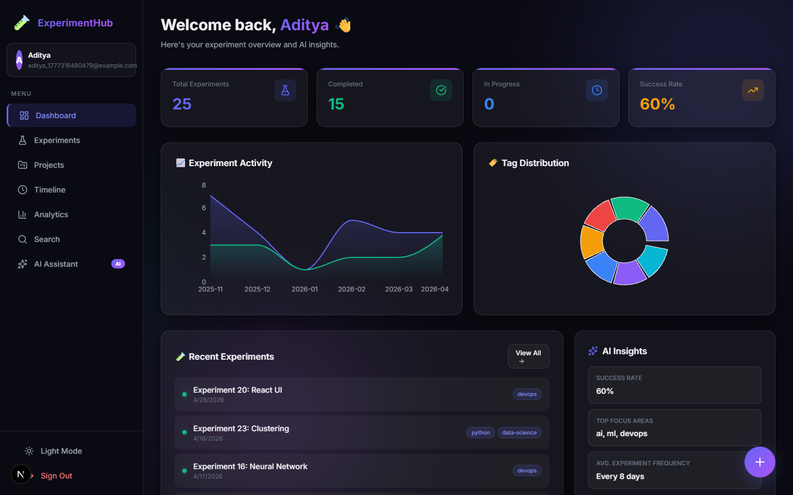
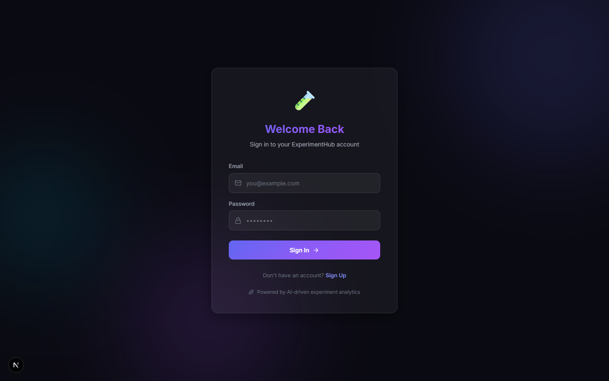

# AI-Powered Experiment Tracking & Learning Platform



🧪 **ExperimentHub** is a production-ready, full-stack web application designed for students, researchers, and developers to document, track, analyze, and iteratively improve their technical experiments over time. It functions as a professional-grade experiment management system, featuring built-in AI insights to accelerate the learning process.

## 🌟 Key Features

### 1. Advanced Experiment Management
*   **Comprehensive Tracking:** Document every aspect of an experiment, including its objective, detailed steps, results, visibility status (draft, in-progress, completed, failed), and success ratings.
*   **Version Control:** Every update to an experiment automatically creates a new revision in the version history, allowing users to track modifications and see exactly how their approach evolved over time.
*   **File Attachments:** Integrated backend file storage allows users to upload relevant context such as code snippets, PDFs, and result images directly to their experiment logs.

### 2. Intelligent AI Integration
*   **Smart Summarization:** Automatically generates concise, readable summaries of complex experiments based on the provided objectives and results.
*   **Automated Tagging:** Analyzes the content of an experiment and automatically categorizes it with relevant technical tags (e.g., AI, React, DevOps).
*   **Actionable Recommendations:** The system analyzes experiment outcomes and provides concrete suggestions on what to try next or how to improve upon failed attempts.
*   **Pattern Recognition:** Analyzes the user's entire history across all experiments to identify global success rates, pinpoint the most common areas of focus, and calculate experiment frequency.
*   **Interactive AI Assistant:** A dedicated, persistent chat interface that acts as a technical mentor, capable of answering contextual questions about the user's tracked work.

### 3. Data Visualization & Analytics
*   **Interactive Dashboard:** A powerful analytics overview built with `recharts`.
*   **Activity Charts:** Area charts visualize experiment creation and completion rates over time.
*   **Status & Tag Distribution:** Pie charts and Bar charts break down the user's active focus areas and project states.
*   **Performance Trends:** Line graphs track the evolution of the user's success ratings across their learning journey.

### 4. Organization & Collaboration
*   **Project Workspaces:** Group related experiments into customizable "Projects" with custom colors and icons for easy organization.
*   **Chronological Timeline:** A beautifully animated vertical timeline that provides a bird's-eye view of the user's entire learning journey month by month.
*   **Public Sharing:** Generate secure, unique URLs to share specific experiments publicly (ideal for portfolios).
*   **Community Feedback:** A threaded commenting system allowing peers or mentors to leave feedback on experiments.

### 5. Premium UI/UX Design
*   **Liquid Glass Aesthetics:** Built entirely from scratch using custom CSS variables and Tailwind CSS, featuring deep dark themes, frosted glass cards (`backdrop-filter`), soft glowing borders, and layered depth.
*   **Micro-animations:** Integrated `framer-motion` for buttery-smooth page transitions, hover effects, and list pop-ins.
*   **Fully Responsive:** The application seamlessly adapts to desktop, tablet, and mobile viewing environments.



## 🛠️ Technology Stack

**Frontend:**
*   **Framework:** Next.js 15 (App Router) + React 19
*   **Styling:** Tailwind CSS v4 + Custom Liquid Glass CSS System
*   **Animations:** Framer Motion
*   **Data Visualization:** Recharts
*   **State Management:** Zustand
*   **Icons:** Lucide React
*   **HTTP Client:** Axios

**Backend:**
*   **Runtime:** Node.js
*   **Framework:** Express.js
*   **Database:** MongoDB (Mongoose ODM)
*   *Note: Includes a robust fail-safe. If a local MongoDB instance is not detected, the server automatically spins up a `mongodb-memory-server` to guarantee the app still runs perfectly in demo mode without any configuration.*
*   **Authentication:** JSON Web Tokens (JWT) + bcryptjs for secure password hashing
*   **File Uploads:** Multer

## 🚀 How to Run Locally

### Prerequisites
*   Node.js (v18 or newer)
*   *(Optional)* MongoDB installed locally or a MongoDB Atlas connection string.

### 1. Clone the Repository
```bash
git clone https://github.com/Aditya529-ux/Experiment-hub.git
cd Experiment-hub
```

### 2. Start the Backend Server
```bash
cd backend
npm install
node server.js
```
*The backend will automatically start on `http://localhost:5000`.*

### 3. Start the Frontend App
Open a new terminal window:
```bash
cd frontend
npm install
npm run dev
```
*The frontend will automatically start on `http://localhost:3000`.*

## 🔒 Security Implementation
*   **Authentication Guards:** Protected routes on both the frontend (Next.js layout guards) and backend (Express middleware).
*   **Password Hashing:** Passwords are never stored in plaintext; they are securely hashed using `bcrypt` before database insertion.
*   **Data Isolation:** All database queries are strictly scoped to the authenticated user's ID (`req.user.id`) to prevent unauthorized cross-account data access.

---
*Designed and built by Aditya.*
